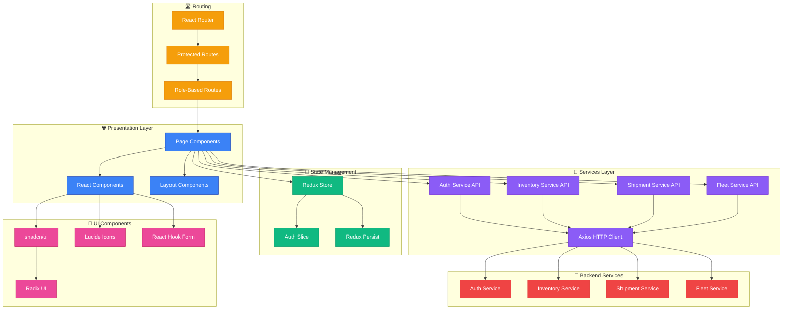
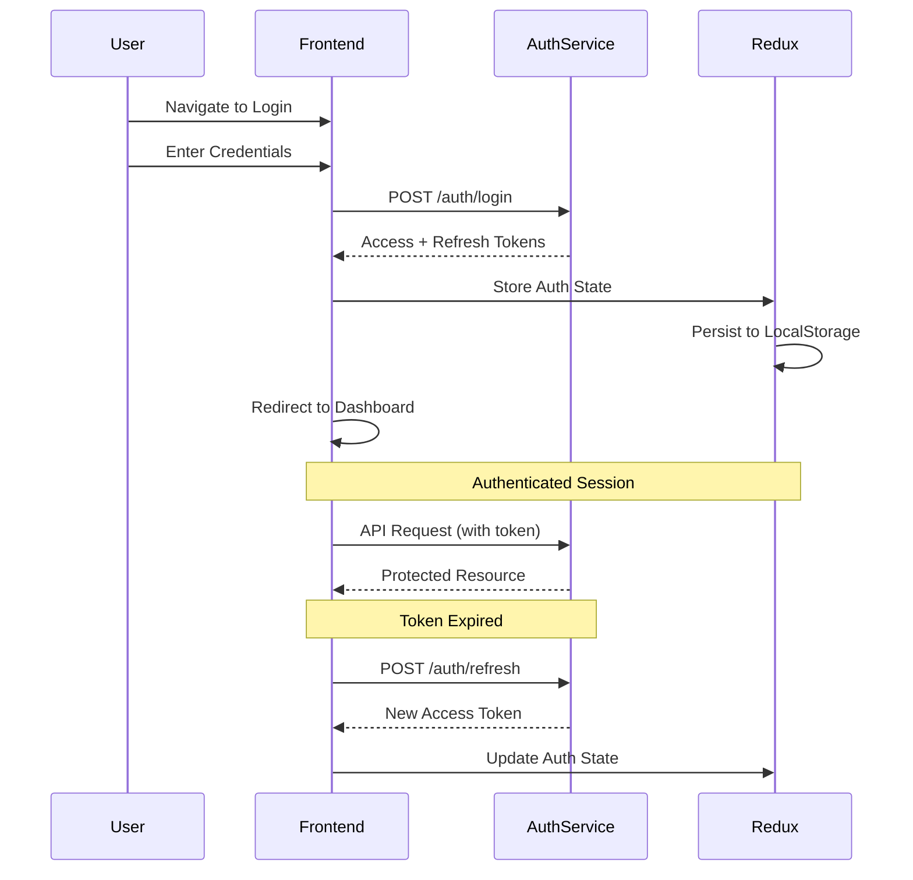

<div align="center">
  <h1>🌐 Fleet OS Frontend</h1>
  <p>
    <strong>Modern Fleet Management Dashboard</strong>
  </p>

[](https://opensource.org/licenses/ISC)


  <p>
    <a href="#-overview">Overview</a> •
    <a href="#-features">Features</a> •
    <a href="#-technology-stack">Tech Stack</a> •
    <a href="#-getting-started">Getting Started</a> •
    <a href="#-project-structure">Structure</a>
  </p>
</div>

---

## 📖 Overview

**Fleet OS Frontend** is a modern, responsive web application for managing fleet operations, logistics, and deliveries. Built with React 19, TypeScript, and Tailwind CSS, it provides intuitive dashboards and workflows for platform administrators, tenant admins, operations managers, and drivers.

### 🎯 Purpose

This application serves as the primary user interface for the Fleet OS platform, providing:

- **Multi-Role Access**: Tailored experiences for different user roles
- **Real-Time Management**: Live tracking and updates for fleet operations
- **Responsive Design**: Mobile-first, works on all device sizes
- **Modern UX**: Clean, intuitive interface with shadcn/ui components
- **Type-Safe**: Full TypeScript coverage for reliability

---

## ✨ Features

### 👥 Role-Based Dashboards

#### 🔑 Platform Admin
- **Tenant Management**: Create, view, and manage tenant organizations
- **System Overview**: Platform-wide analytics and monitoring
- **Onboarding**: Tenant registration and setup workflows

#### 🏢 Tenant Admin
- **User Management**: Invite and manage tenant users
- **Fleet Management**: Manage vehicles and drivers
- **Warehouse Operations**: Inventory and stock management
- **Shipment Oversight**: Monitor all shipments
- **Organization Settings**: Configure tenant details

#### 📊 Operations Manager
- **Shipment Management**: Create and track shipments
- **Driver Assignment**: Assign shipments to drivers
- **Inventory Coordination**: Work with warehouse stock
- **Route Planning**: Optimize delivery routes
- **Status Monitoring**: Real-time shipment tracking

#### 🚗 Driver
- **My Shipments**: View assigned deliveries
- **Status Updates**: Update shipment progress (Picked, In Transit, Delivered)
- **Delivery Information**: Customer details and addresses
- **Route Guidance**: Integrated maps for navigation

### 📦 Core Modules

#### Inventory Management
- Warehouse creation and management
- Inventory item catalog
- Stock level tracking
- Low stock alerts
- Multi-warehouse support

#### Fleet Management
- Vehicle registration and tracking
- Driver onboarding and management
- Maintenance scheduling
- Vehicle-driver assignment

#### Shipment Operations
- Create shipments with multiple items
- Automatic stock reservation
- Driver assignment workflow
- Real-time status tracking
- Delivery confirmation

### 🎨 UI/UX Features

- **Dark Mode**: System-preference aware dark theme
- **Responsive Tables**: TanStack Table with sorting, filtering, pagination
- **Interactive Maps**: Leaflet integration for location tracking
- **Form Validation**: Zod + React Hook Form for type-safe forms
- **Toast Notifications**: Sonner for elegant toast messages
- **Loading States**: Skeleton screens and loading indicators
- **Error Handling**: User-friendly error messages

---

## 🏛 Architecture



---

## 🛠 Technology Stack

### Core Technologies

| Category           | Technology | Version | Purpose |
| :----------------- | :--------- | :------ | :------ |
| **Framework**      |  | 19.2 | UI library |
| **Language**       |  | 5.9 | Type safety |
| **Build Tool**     |  | 7.3 | Fast dev server & bundler |
| **Styling**        |  | 4.1 | Utility-first CSS |

### Key Libraries

| Library | Purpose |
| :------ | :------ |
| **Redux Toolkit** | Centralized state management |
| **React Router** | Client-side routing |
| **React Hook Form** | Form management |
| **Zod** | Runtime type validation |
| **TanStack Table** | Advanced data tables |
| **shadcn/ui** | Pre-built component library |
| **Radix UI** | Accessible UI primitives |
| **Axios** | HTTP client |
| **Leaflet** | Interactive maps |
| **Sonner** | Toast notifications |
| **Lucide React** | Icon library |
| **date-fns** | Date utilities |
| **jwt-decode** | JWT token parsing |

---

## 📂 Project Structure

```
fleet-os-frontend/
├── public/                      # Static assets
├── src/
│   ├── components/              # 🧩 Reusable UI components
│   │   ├── ui/                  # shadcn/ui components
│   │   ├── ProtectedRoute.tsx   # Route guards
│   │   ├── Navbar.tsx           # Navigation bar
│   │   └── ...
│   │
│   ├── layouts/                 # 📐 Layout components
│   │   ├── DashboardLayout.tsx
│   │   ├── AdminLayout.tsx
│   │   └── AuthLayout.tsx
│   │
│   ├── pages/                   # 📄 Page components
│   │   ├── admin/               # Platform admin pages
│   │   ├── tenant/              # Tenant admin pages
│   │   │   ├── dashboard/
│   │   │   ├── inventory/
│   │   │   ├── fleet/
│   │   │   ├── shipments/
│   │   │   └── users/
│   │   ├── ops-manager/         # Operations manager pages
│   │   ├── driver/              # Driver pages
│   │   ├── auth/                # Authentication pages
│   │   └── LandingPage.tsx
│   │
│   ├── routes/                  # 🛣️ Route configuration
│   │   ├── AppRoutes.tsx        # Main route definitions
│   │   └── ...
│   │
│   ├── services/                # 📡 API service layer
│   │   ├── auth.service.ts
│   │   ├── inventory.service.ts
│   │   ├── shipment.service.ts
│   │   ├── fleet.service.ts
│   │   └── api.ts               # Axios instance
│   │
│   ├── store/                   # 🗄️ Redux store
│   │   ├── index.ts             # Store configuration
│   │   └── auth/                # Auth slice
│   │
│   ├── hooks/                   # 🪝 Custom React hooks
│   │   ├── useAuth.ts
│   │   └── ...
│   │
│   ├── types/                   # 📝 TypeScript types
│   │   ├── auth.types.ts
│   │   ├── inventory.types.ts
│   │   └── ...
│   │
│   ├── schemas/                 # ✅ Zod validation schemas
│   │   ├── auth.schemas.ts
│   │   └── ...
│   │
│   ├── lib/                     # 🔧 Utilities
│   │   └── utils.ts
│   │
│   ├── App.tsx                  # Root component
│   ├── main.tsx                 # Application entry
│   └── index.css                # Global styles
│
├── index.html                   # HTML template
├── vite.config.ts               # Vite configuration
├── tailwind.config.js           # Tailwind configuration
├── tsconfig.json                # TypeScript configuration
└── package.json
```

---

## 🚀 Getting Started

### Prerequisites

- **Node.js** >= 20.x
- **pnpm** >= 9.x
- Backend services running (Auth, Inventory, Shipment, Fleet)

### Installation

1. **Clone the repository**

```bash
git clone https://github.com/ijas9118/fleet-os-frontend.git
cd fleet-os-frontend
```

2. **Install dependencies**

```bash
pnpm install
```

3. **Configure environment**

Create `.env` file:

```env
VITE_API_BASE_URL=http://localhost:3000/api/v1
VITE_AUTH_SERVICE_URL=http://localhost:3001/api/v1
VITE_INVENTORY_SERVICE_URL=http://localhost:3004/api/v1
VITE_SHIPMENT_SERVICE_URL=http://localhost:3002/api/v1
VITE_FLEET_SERVICE_URL=http://localhost:3003/api/v1
```

4. **Run development server**

```bash
pnpm dev
```

The application will start on `http://localhost:5173`

### Building for Production

```bash
# Type check
pnpm run build

# Preview production build
pnpm preview
```

### Code Quality

```bash
# Lint code
pnpm lint

# Fix linting issues
pnpm lint:fix

# Format code
pnpm format

# Check formatting
pnpm format:check
```

---

## 🎨 UI Component System

### shadcn/ui Components

Pre-built, accessible, and customizable components:

- **Button** - Various styles and sizes
- **Dialog** - Modal dialogs
- **Select** - Dropdown selects
- **Input** - Form inputs
- **Label** - Form labels
- **Avatar** - User avatars
- **Alert** - Alert messages
- **Separator** - Visual dividers
- **Tooltip** - Hover tooltips
- **DropdownMenu** - Context menus

### Custom Components

- **DataTable** - Advanced tables with TanStack Table
- **ProtectedRoute** - Authentication guards
- **RoleBasedRoute** - Authorization guards
- **Navbar** - Navigation component
- **Sidebar** - Dashboard sidebar

---

## 🔐 Authentication Flow



---

## 🛣️ Routing Structure

### Public Routes
- `/` - Landing page
- `/auth/login` - Login page
- `/auth/register/*` - Registration flows

### Protected Routes (Authenticated)

#### Platform Admin (`PLATFORM_ADMIN`)
- `/admin/dashboard` - Admin dashboard
- `/admin/tenants` - Tenant management

#### Tenant Admin (`TENANT_ADMIN`)
- `/tenant/dashboard` - Tenant dashboard
- `/tenant/inventory/*` - Inventory management
- `/tenant/fleet/*` - Fleet management
- `/tenant/shipments/*` - Shipment oversight
- `/tenant/users/*` - User management

#### Operations Manager (`OPERATIONS_MANAGER`)
- `/ops-manager/dashboard` - Ops dashboard
- `/ops-manager/shipments/*` - Shipment operations
- `/ops-manager/assignments/*` - Driver assignments

#### Driver (`DRIVER`)
- `/driver/dashboard` - Driver dashboard
- `/driver/shipments` - My shipments
- `/driver/shipments/:id` - Shipment details

---

## 🧪 Development Guidelines

### Component Guidelines

- Use functional components with hooks
- Implement TypeScript interfaces for props
- Use shadcn/ui components when possible
- Follow atomic design principles
- Keep components focused and reusable

### State Management

- Use Redux for global state (auth, user)
- Use component state for local UI state
- Use React Hook Form for form state
- Persist auth state with redux-persist

### Styling

- Use Tailwind utility classes
- Follow mobile-first approach
- Use CSS variables for theming
- Avoid inline styles

### API Integration

- Use service layer abstraction
- Handle loading and error states
- Show user-friendly error messages
- Implement request/response interceptors

---

## 🚀 Deployment

### Build

```bash
pnpm build
```

Output will be in `dist/` directory.

### Deployment Options

- **Vercel** - Recommended for Vite apps
- **Netlify** - Simple static hosting
- **AWS S3 + CloudFront** - Scalable CDN
- **Docker** - Containerized deployment

### Environment Setup

Set environment variables in your deployment platform matching the `.env` format.

---

## 🤝 Contributing

Contributions are welcome! Please follow these guidelines:

1. Fork the repository
2. Create a feature branch (`git checkout -b feature/amazing-feature`)
3. Follow code style guidelines
4. Run linting and formatting (`pnpm lint:fix && pnpm format`)
5. Commit your changes (`git commit -m 'Add amazing feature'`)
6. Push to the branch (`git push origin feature/amazing-feature`)
7. Open a Pull Request

---

## 📄 License

This project is licensed under the **ISC License**.

---

<div align="center">
  <p>Built with ❤️ for the Fleet OS Platform</p>
  <p>
    <a href="https://github.com/ijas9118/fleet-os-frontend">GitHub</a> •
    <a href="https://github.com/ijas9118/fleet-os-frontend/issues">Issues</a>
  </p>
</div>
